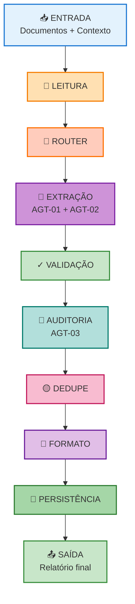
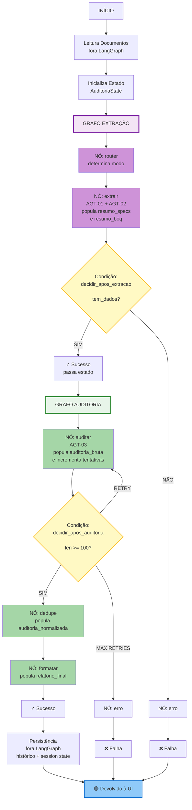
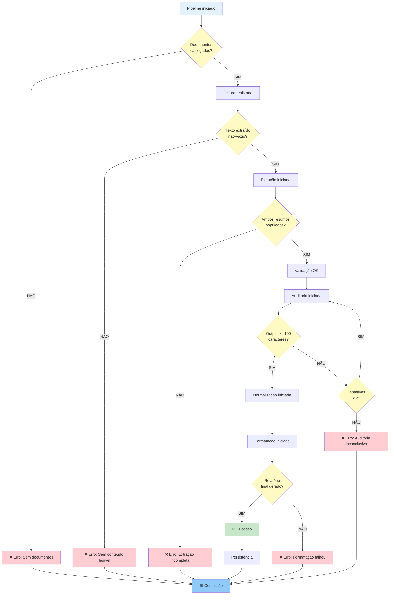

# Fluxo de Pipeline - Diagrama Mermaid

## Diagrama 1: Fluxo Sequencial Completo

```mermaid
graph TD
    START["🟢 INÍCIO<br/>Utilizador submete documentos"] --> READ["📖 LEITURA DE DOCUMENTOS<br/>━━━━━━━━━━━━━━━━━━━<br/>• Parse BOQ.csv<br/>• Parse SPECS.pdf/docx<br/>• Detecção encoding<br/>• Marcadores de origem<br/>• Aviso: páginas sem OCR"]
    
    READ --> POPULATE["🔨 POPULAÇÃO ESTADO INICIAL<br/>━━━━━━━━━━━━━━━━━━━<br/>texto_boq: str<br/>texto_specs: str<br/>contexto_projeto: dict<br/>guia_filtragem: str"]
    
    POPULATE --> ROUTER["🚦 ROUTER INICIAL<br/>━━━━━━━━━━━━━━━━━━━<br/>Determina modo:"]
    
    ROUTER -->|ambos BOQ+SPECS| CROSS["✓ CROSS<br/>Auditoria cruzada"]
    ROUTER -->|só um documento| SINGLE["⚠️ SINGLE<br/>Validação simples"]
    
    CROSS --> EXTRACT["🔷 EXTRAÇÃO DE SPECS E BOQ<br/>━━━━━━━━━━━━━━━━━━━<br/>Nó AGT-01 (SPECS):<br/>  • Estrutura em JSON<br/>  • Materiais, normas, tolerâncias<br/>  • Remove comercial + betão<br/><br/>Nó AGT-02 (BOQ):<br/>  • Detecta formato (CSV/PDF)<br/>  • Mapeia Phase/Zone/Subzone<br/>  • Contexto de SPECS injetado"]
    SINGLE --> EXTRACT
    
    EXTRACT --> EXTRACTOK{Extração<br/>bem-sucedida?}
    
    EXTRACTOK -->|ambos não-vazios| VALIDATE["✓ VALIDAÇÃO INTERMÉDIA<br/>━━━━━━━━━━━━━━━━━━━<br/>• Verifica tamanho mínimo<br/>• Detecta JSON inválido<br/>• Rastreia páginas sem texto<br/>• Acumula erros se houver"]
    EXTRACTOK -->|dados vazios| ERROR1["❌ Erro: Extração falhou<br/>Sem dados para prosseguir"]
    
    ERROR1 --> END_FAIL["🔴 CONCLUSÃO (Falha)<br/>Erros exibidos na UI"]
    
    VALIDATE --> VALIDATEOK{Estado<br/>válido?}
    VALIDATEOK -->|SIM| AUDIT["🔶 AUDITORIA CRUZADA<br/>━━━━━━━━━━━━━━━━━━━<br/>Nó AGT-03 (Auditor):<br/>  • Compara resumo_specs<br/>    vs resumo_boq<br/>  • Aplica contexto_projeto<br/>  • Identifica:<br/>    - Alinhamentos<br/>    - Conflitos<br/>    - Lacunas"]
    VALIDATEOK -->|NÃO| ERROR2["❌ Erro: Estado inválido<br/>Metadados inconsistentes"]
    
    ERROR2 --> END_FAIL
    
    AUDIT --> AUDITOK{Auditoria<br/>completa?<br/>len >= 100}
    
    AUDITOK -->|SIM| DEDUPE["🟡 DEDUPLICAÇÃO E NORMALIZAÇÃO<br/>━━━━━━━━━━━━━━━━━━━<br/>Nó Dedupe:<br/>  • Remove linhas duplicadas<br/>  • Normaliza formatação<br/>  • Agrupa por Phase/Zone<br/>  • Mantém rastreabilidade"]
    AUDITOK -->|NÃO| RETRY{Tentativas<br/>< 2?}
    
    RETRY -->|SIM| AUDIT
    RETRY -->|NÃO| ERROR3["❌ Erro: Auditoria falhou<br/>Output muito curto<br/>após 2 tentativas"]
    
    ERROR3 --> END_FAIL
    
    DEDUPE --> FORMAT["🎨 FORMATAÇÃO DO RELATÓRIO FINAL<br/>━━━━━━━━━━━━━━━━━━━<br/>Nó Apresentador:<br/>  • Cabeçalhos visuais<br/>  • Sumário executivo<br/>  • Separadores & estilos<br/>  • Rodapé com metadata<br/>  • Timestamps"]
    
    FORMAT --> PERSIST["💾 PERSISTÊNCIA<br/>━━━━━━━━━━━━━━━━━━━<br/>• Escreve relatório em<br/>  historico_auditorias/<br/>  Auditoria_[timestamp].txt<br/><br/>• Atualiza session state<br/>  st.session_state.relatorio_final<br/>  st.session_state.erros"]
    
    PERSIST --> SUCCESS["🟢 CONCLUSÃO (Sucesso)<br/>Relatório pronto para display<br/>e download"]
    
    SUCCESS --> END["Utilizador vê resultados<br/>na interface Streamlit"]
    END_FAIL --> END
    
    style START fill:#90caf9,stroke:#1976d2,stroke-width:2px
    style READ fill:#ffe0b2,stroke:#f57c00,stroke-width:2px
    style POPULATE fill:#fff9c4,stroke:#fbc02d,stroke-width:2px
    style ROUTER fill:#ffccbc,stroke:#ff6f00,stroke-width:2px
    style CROSS fill:#b3e5fc
    style SINGLE fill:#b3e5fc
    style EXTRACT fill:#ce93d8,stroke:#7b1fa2,stroke-width:2px
    style EXTRACTOK fill:#fff9c4,stroke:#fbc02d
    style VALIDATE fill:#c8e6c9,stroke:#388e3c,stroke-width:2px
    style VALIDATEOK fill:#fff9c4,stroke:#fbc02d
    style AUDIT fill:#b2dfdb,stroke:#00796b,stroke-width:2px
    style AUDITOK fill:#fff9c4,stroke:#fbc02d
    style DEDUPE fill:#f8bbd0,stroke:#c2185b,stroke-width:2px
    style FORMAT fill:#e1bee7,stroke:#6a1b9a,stroke-width:2px
    style PERSIST fill:#a5d6a7,stroke:#2e7d32,stroke-width:2px
    style SUCCESS fill:#90caf9,stroke:#1976d2,stroke-width:2px
    style END fill:#90caf9,stroke:#1976d2,stroke-width:2px
    style ERROR1 fill:#ffcdd2,stroke:#d32f2f,stroke-width:2px
    style ERROR2 fill:#ffcdd2,stroke:#d32f2f,stroke-width:2px
    style ERROR3 fill:#ffcdd2,stroke:#d32f2f,stroke-width:2px
    style END_FAIL fill:#ef5350,stroke:#c62828,stroke-width:2px
```

---

## Diagrama 2: Fluxo Simplificado (Visão Executiva)

---

## Diagrama 3: Fluxo com Nós LangGraph

---

## Diagrama 4: Ciclo de Transformação de Dados

```mermaid
graph LR
    TX1["texto_boq<br/>texto_specs"] -->|nó router| TX2["modo:<br/>CROSS/SINGLE"]
    
    TX2 -->|nó extrair| TX3["resumo_specs<br/>resumo_boq"]
    
    TX3 -->|decisão| TX4{validação<br/>OK?}
    
    TX4 -->|SIM| TX5["resumo_specs<br/>resumo_boq<br/>contexto_projeto"]
    
    TX5 -->|nó auditar| TX6["auditoria_bruta<br/>tentativas"]
    
    TX6 -->|decisão| TX7{tamanho<br/>OK?}
    
    TX7 -->|SIM| TX8["auditoria_bruta"]
    TX7 -->|RETRY| TX6
    
    TX8 -->|nó dedupe| TX9["auditoria_normalizada"]
    
    TX9 -->|nó formatar| TX10["relatorio_final<br/>com headers<br/>e footer"]
    
    TX10 -->|persistência| TX11["Ficheiro txt<br/>+ session state"]
    
    style TX1 fill:#e3f2fd
    style TX2 fill:#ffe0b2
    style TX3 fill:#ce93d8
    style TX4 fill:#fff9c4
    style TX5 fill:#c8e6c9
    style TX6 fill:#b2dfdb
    style TX7 fill:#fff9c4
    style TX8 fill:#f8bbd0
    style TX9 fill:#f8bbd0
    style TX10 fill:#e1bee7
    style TX11 fill:#a5d6a7
```

---

## Diagrama 5: Árvore de Decisão

