# DIAGRAMAS TÉCNICOS - BlocoAI
## 13 Visualizações Mermaid para Relatório Académico

**Objetivo:** Inserir diagrama por diagrama no seu relatório académico. Cada diagrama é exportável como PNG via mermaid.live

---

## INSTRUÇÕES DE USO

Para cada diagrama que quiser incluir no seu relatório:

```
1. Copie o código Mermaid (entre ```mermaid e ```)
2. Vá para: https://mermaid.live
3. Cole o código no editor
4. Click direito → Download as PNG (ou SVG)
5. Insira no seu documento Word/PDF
6. Adicione legenda: "Figura X: [Título e Descrição]"
```

---

## DIAGRAMA 1: Arquitetura em 5 Camadas

**Uso:** Secção 3 (Arquitetura) - explicar pilares do sistema

**Descrição:** Mostra as 5 camadas horizontais de BlocoAI, desde UI até persistência de dados.

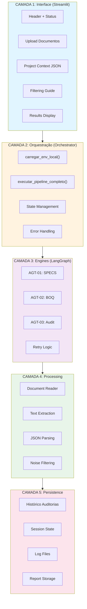

---

## DIAGRAMA 2: Fluxo de Dados (DFD - Nível 0)

**Uso:** Secção 5 (Implementação) - explicar pipeline de processamento

**Descrição:** Mostra entrada do utilizador → processamento através de 3 agentes → saída final.

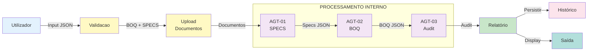

---

## DIAGRAMA 3: Estado através das 3 Fases de Processamento

**Uso:** Secção 6 (Exemplos Práticos) - mostrar evolução do estado

**Descrição:** Mostra como o estado evolui conforme passa por cada fase.

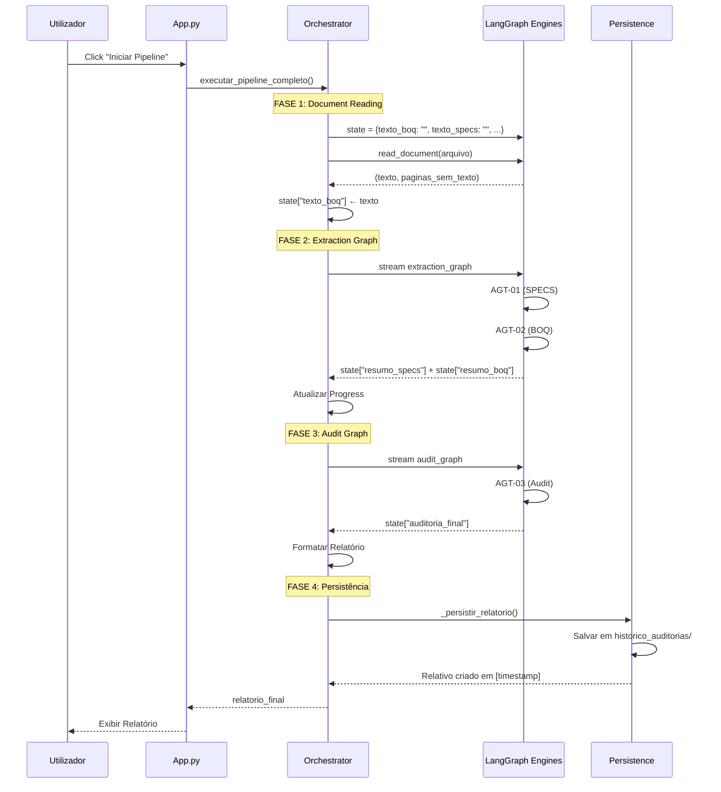

---

## DIAGRAMA 4: Sequência de Invocação LLM com Retry

**Uso:** Secção 5 (Implementação) - explicar resilência e retry

**Descrição:** Mostra como o retry exponencial trata falhas de API.

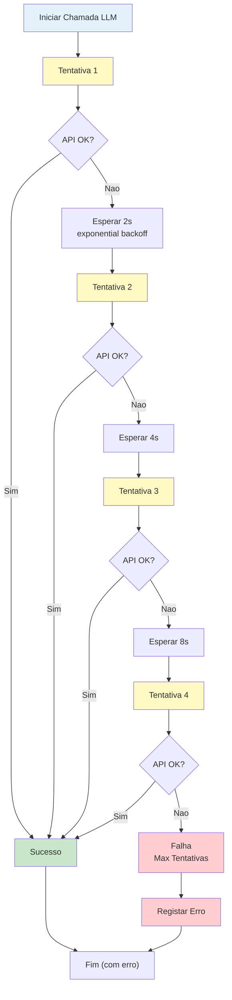

---

## DIAGRAMA 5: Grafo de Extração (AGT-01 + AGT-02)

**Uso:** Secção 3 (Arquitetura) - explicar fluxo interno dos agentes

**Descrição:** LangGraph state machine para extração de SPECS e BOQ.

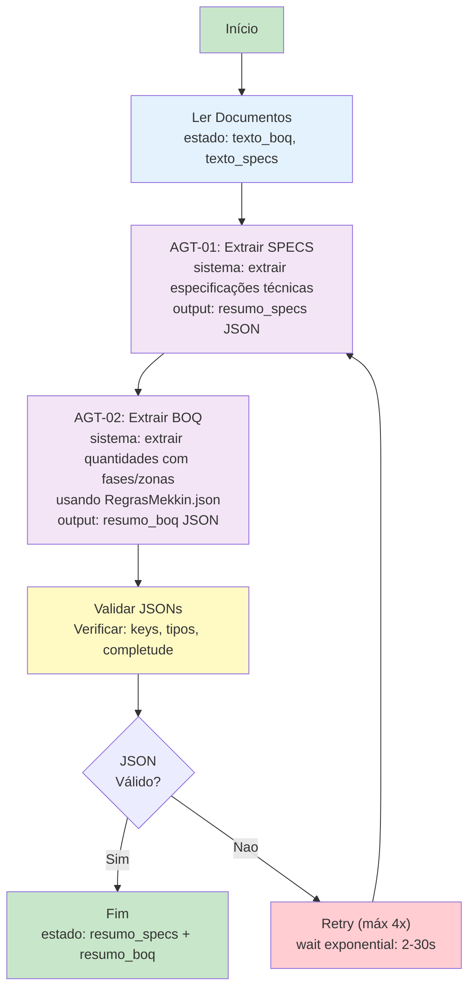

---

## DIAGRAMA 6: Grafo de Auditoria (AGT-03)

**Uso:** Secção 3 (Arquitetura) - explicar auditoria cruzada SPECS vs BOQ

**Descrição:** Estado machine para validação cruzada e geração de relatório final.

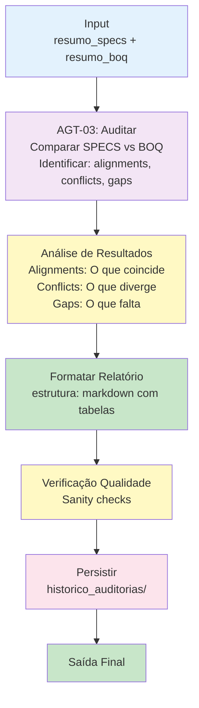

---

## DIAGRAMA 7: Padrão de Retry com Exponential Backoff

**Uso:** Secção 5 (Implementação) - detalhe técnico de resilência

**Descrição:** Visualização detalhada do padrão tenacity utilizado.

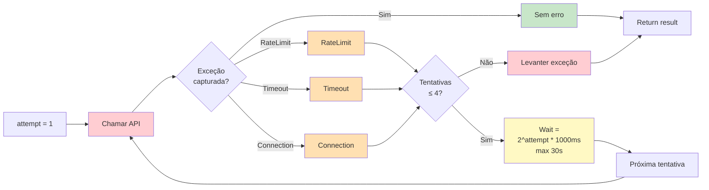

---

## DIAGRAMA 8: Validação de Input (UI)

**Uso:** Secção 6 (Exemplos) - mostrar validações antes processamento

**Descrição:** Fluxo de validação que usuário passa antes "Iniciar Pipeline".

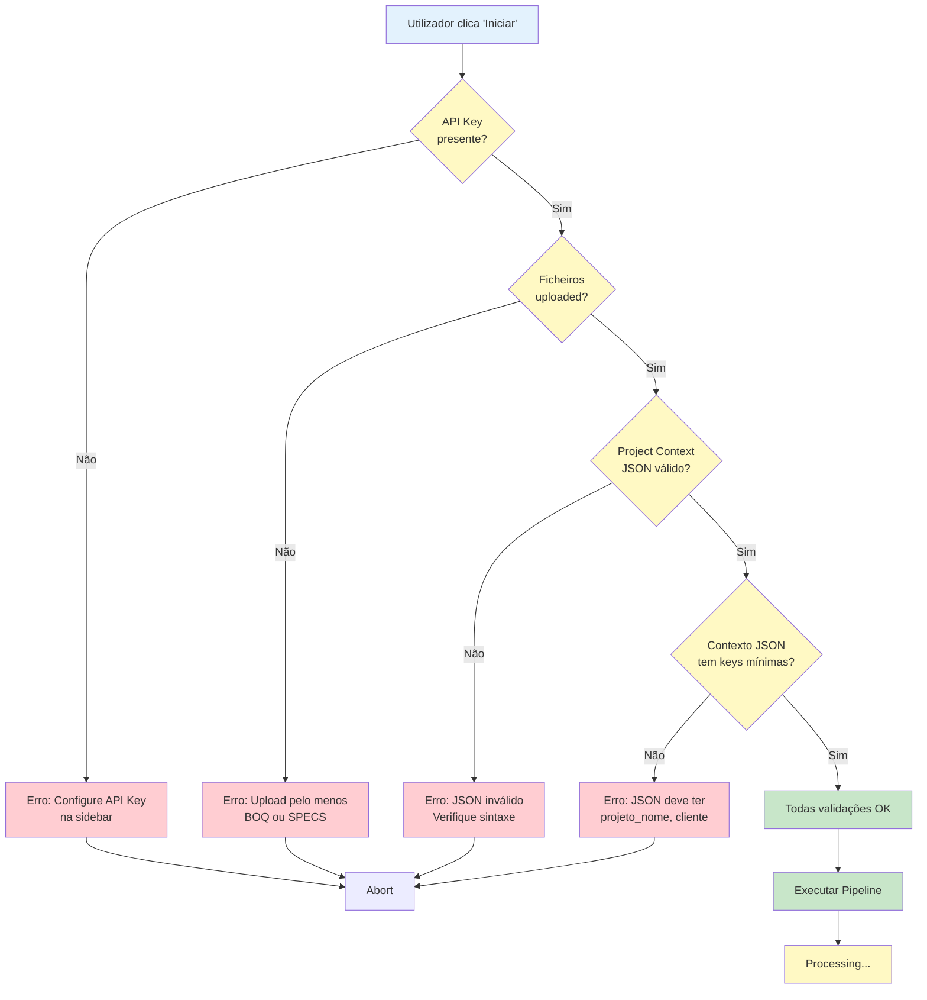

---

## DIAGRAMA 9: Árvore de Componentes UI (Streamlit)

**Uso:** Secção 3 (Arquitetura) - estrutura hierárquica da UI

**Descrição:** Hierarquia de componentes Streamlit chamados em ordem.

```mermaid
graph TB
    ROOT["App.py<br/>main()"]
    
    ENV["carregar_env_local()"]
    
    SIDEBAR["Sidebar<br/>setup_sidebar()"]
    API["API Key Input"]
    STATUS["Status Badge"]
    
    HEADER["render_header()"]
    TITLE["Title Band"]
    
    CONTEXT["render_project_context_section()"]
    CONTEXT_FILE["File Upload / Paste"]
    CONTEXT_JSON["Project Baseline JSON"]
    
    UPLOAD["render_upload_section()"]
    UPLOAD_BOQ["BOQ Uploader"]
    UPLOAD_SPECS["SPECS Uploader"]
    
    FOCUS["render_focus_section()"]
    FOCUS_GUIDE["Filtering Guide (TextArea)"]
    
    RESULTS_SECTION["render_results()"]
    RESULTS_TEXT["Final Report Display"]
    RESULTS_DOWNLOAD["Download Button"]
    
    STATE["ensure_session_defaults()"]
    
    ROOT --> ENV
    ROOT --> STATE
    ROOT --> SIDEBAR
    ROOT --> HEADER
    ROOT --> CONTEXT
    ROOT --> UPLOAD
    ROOT --> FOCUS
    ROOT --> RESULTS_SECTION
    
    SIDEBAR --> API
    SIDEBAR --> STATUS
    
    HEADER --> TITLE
    
    CONTEXT --> CONTEXT_FILE
    CONTEXT --> CONTEXT_JSON
    
    UPLOAD --> UPLOAD_BOQ
    UPLOAD --> UPLOAD_SPECS
    
    FOCUS --> FOCUS_GUIDE
    
    RESULTS_SECTION --> RESULTS_TEXT
    RESULTS_SECTION --> RESULTS_DOWNLOAD
    
    style ROOT fill:#e3f2fd
    style ENV fill:#fff9c4
    style STATE fill:#fff9c4
    style SIDEBAR fill:#f3e5f5
    style HEADER fill:#e1f5ff
    style CONTEXT fill:#c8e6c9
    style UPLOAD fill:#c8e6c9
    style FOCUS fill:#c8e6c9
    style RESULTS_SECTION fill:#f8bbd0
```

---

## DIAGRAMA 10: Ciclo de Vida do Estado (SessionState)

**Uso:** Secção 5 (Implementação) - explicar session state management

**Descrição:** Como estado persiste e evolui através de reruns Streamlit.

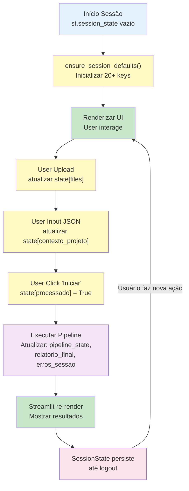

---

## DIAGRAMA 11: Matriz RACI de Responsabilidades

**Uso:** Secção 4 (Design) - clarificar responsabilidades entre componentes

**Descrição:** Matriz de quem faz o quê (Responsible, Accountable, Consulted, Informed).

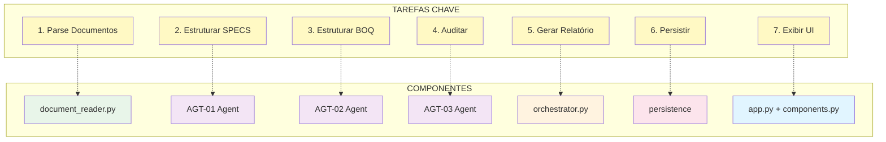

---

## DIAGRAMA 12: Timeline de ADRs (Decisões Arquiteturais)

**Uso:** Secção 4 (Design) - mostrar evolução de decisões

**Descrição:** Cronologia das 5 decisões técnicas principais e suas razões.

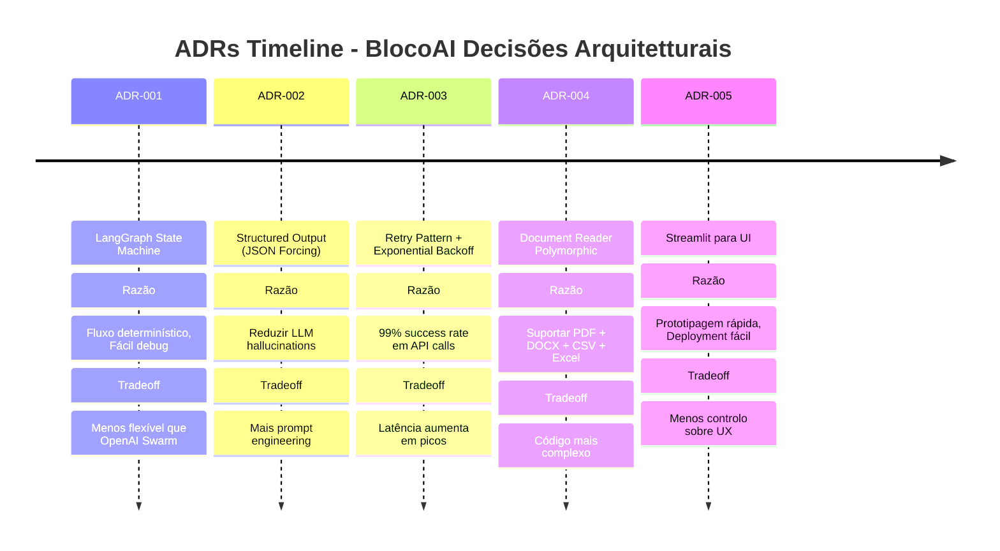

---

## DIAGRAMA 13: Fluxo de Tratamento de Erros

**Uso:** Secção 8 (Desafios) - explicar como erros são capturados e reportados

**Descrição:** End-to-end error handling com tracking e feedback.

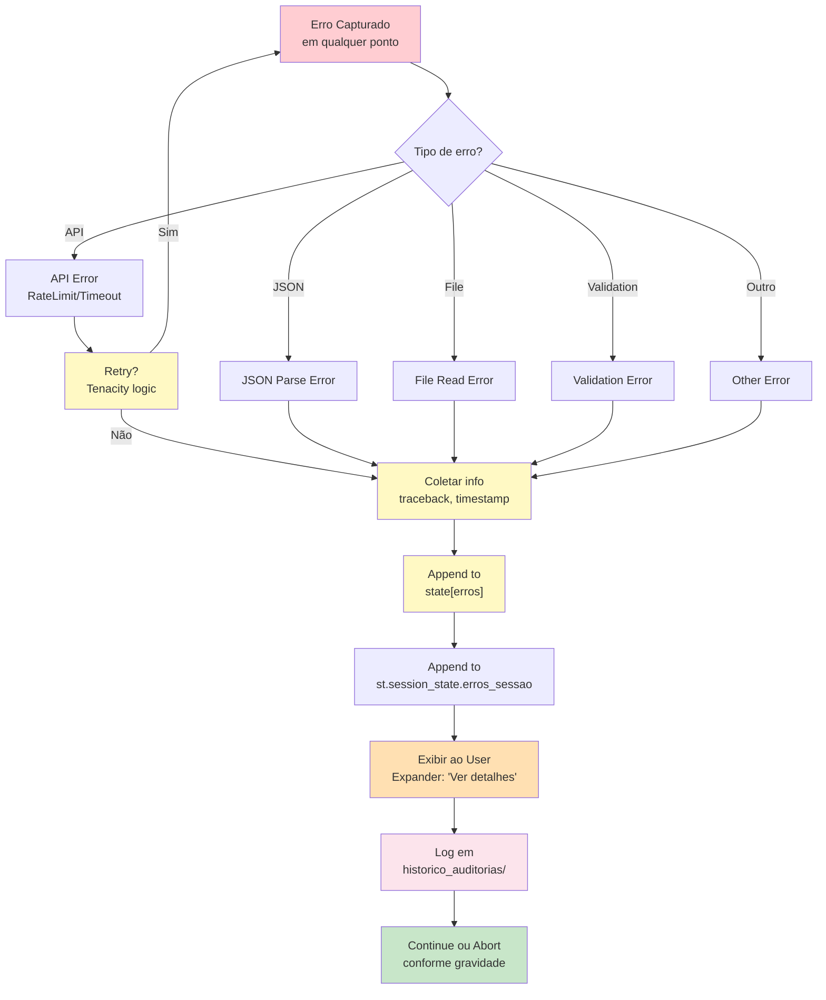

---

## CHECKLIST DE DIAGRAMAS

Utilize este checklist para inserir os diagramas no seu relatório:

- [ ] **DIAGRAMA 1** - Arquitetura 5 Camadas → Secção 3 (Arquitetura)
- [ ] **DIAGRAMA 2** - Fluxo de Dados → Secção 5 (Implementação)
- [ ] **DIAGRAMA 3** - Estado através Fases → Secção 6 (Exemplos Práticos)
- [ ] **DIAGRAMA 4** - Sequência LLM + Retry → Secção 5 (Implementação)
- [ ] **DIAGRAMA 5** - Grafo Extração → Secção 3 (Arquitetura)
- [ ] **DIAGRAMA 6** - Grafo Auditoria → Secção 3 (Arquitetura)
- [ ] **DIAGRAMA 7** - Retry Exponential → Secção 5 (Implementação)
- [ ] **DIAGRAMA 8** - Validação Input → Secção 6 (Exemplos)
- [ ] **DIAGRAMA 9** - Árvore UI → Secção 3 (Arquitetura)
- [ ] **DIAGRAMA 10** - Ciclo SessionState → Secção 5 (Implementação)
- [ ] **DIAGRAMA 11** - Matriz RACI → Secção 4 (Design)
- [ ] **DIAGRAMA 12** - Timeline ADRs → Secção 4 (Design)
- [ ] **DIAGRAMA 13** - Fluxo Erros → Secção 8 (Desafios)

**Mínimo recomendado para relatório:** Inserir pelo menos 8-10 diagramas

---

## 🔗 LINKS E RECURSOS

### Como Exportar Diagrama:

1. Copie uma secção inteira (```mermaid ... ```)
2. Vá para [Mermaid Live](https://mermaid.live)
3. Cole no editor
4. Click direito na imagem → Download as PNG/SVG
5. Salve com nome: `Figura_X_Descricao.png`
6. Insira em Word: Insert → Pictures → This Device
7. Adicione legenda: "Figura X: [Título e Descrição breve]"

### Alternativa: Extensão Mermaid4Word

Se usar Microsoft Word:
- Instale [Mermaid4Word](https://appsource.microsoft.com/en-us/product/office/WA200002467)
- Copie código Mermaid directamente no Word
- Renderiza automaticamente
- Mais profissional e dinâmico

---

## 📐 DICAS DE FORMATAÇÃO

### No seu relatório académico:

```markdown
## Secção 3: Arquitetura

A arquitetura de BlocoAI segue um padrão de 5 camadas...

[Insira Figura 1 aqui: Arquitetura em 5 Camadas]

**Figura 1:** Arquitetura de BlocoAI com as 5 camadas: Interface (Streamlit),
Orquestração (Python), Engines (LangGraph), Processamento (Parsing), e Persistência
(Ficheiros + Session). Cada camada tem responsabilidades bem definidas.

O fluxo de dados segue...

[Insira Figura 2 aqui: Fluxo de Dados]

**Figura 2:** Fluxo de dados do sistema: Utilizador → Upload → AGT-01 (SPECS) →
AGT-02 (BOQ) → AGT-03 (Auditoria) → Relatório → Histórico.
```

---

## RESUMO

Você tem 13 diagramas Mermaid prontos para inserir no seu relatório académico:

| # | Diagrama | Localização no Relatório |
|---|----------|--------------------------|
| 1 | Arquitetura 5 Camadas | Secção 3 - Arquitetura |
| 2 | Fluxo de Dados | Secção 5 - Implementação |
| 3 | Estado através Fases | Secção 6 - Exemplos |
| 4 | Sequência LLM + Retry | Secção 5 - Implementação |
| 5 | Grafo Extração | Secção 3 - Arquitetura |
| 6 | Grafo Auditoria | Secção 3 - Arquitetura |
| 7 | Retry Exponential Backoff | Secção 5 - Implementação |
| 8 | Validação Input | Secção 6 - Exemplos |
| 9 | Árvore UI | Secção 3 - Arquitetura |
| 10 | Ciclo SessionState | Secção 5 - Implementação |
| 11 | Matriz RACI | Secção 4 - Design |
| 12 | Timeline ADRs | Secção 4 - Design |
| 13 | Fluxo de Erros | Secção 8 - Desafios |

---

**Todos os diagramas estão prontos. Bom trabalho no seu relatório!** 🚀
