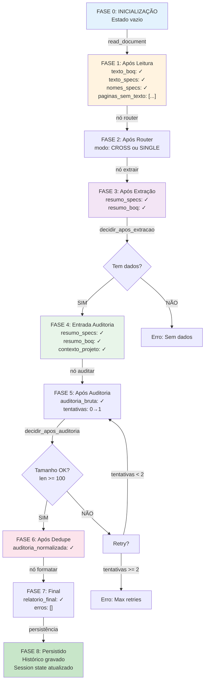
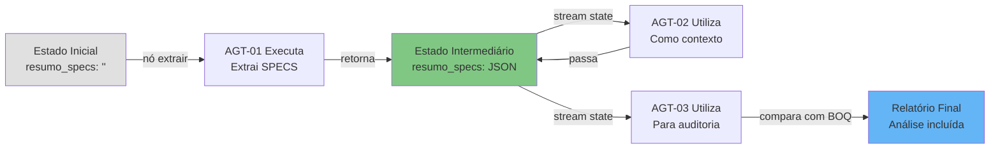
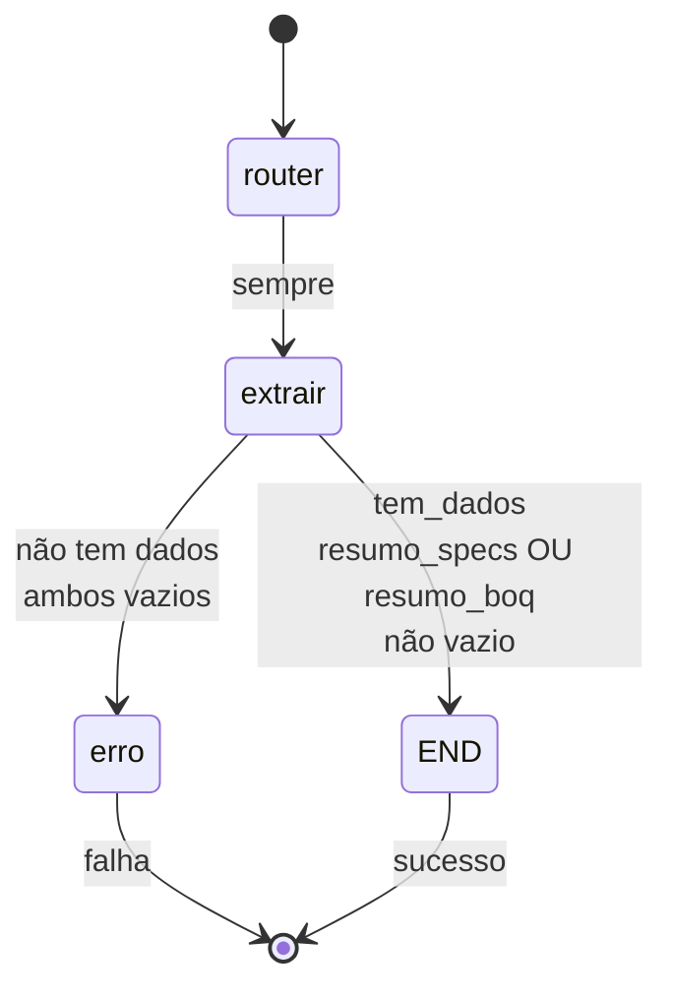
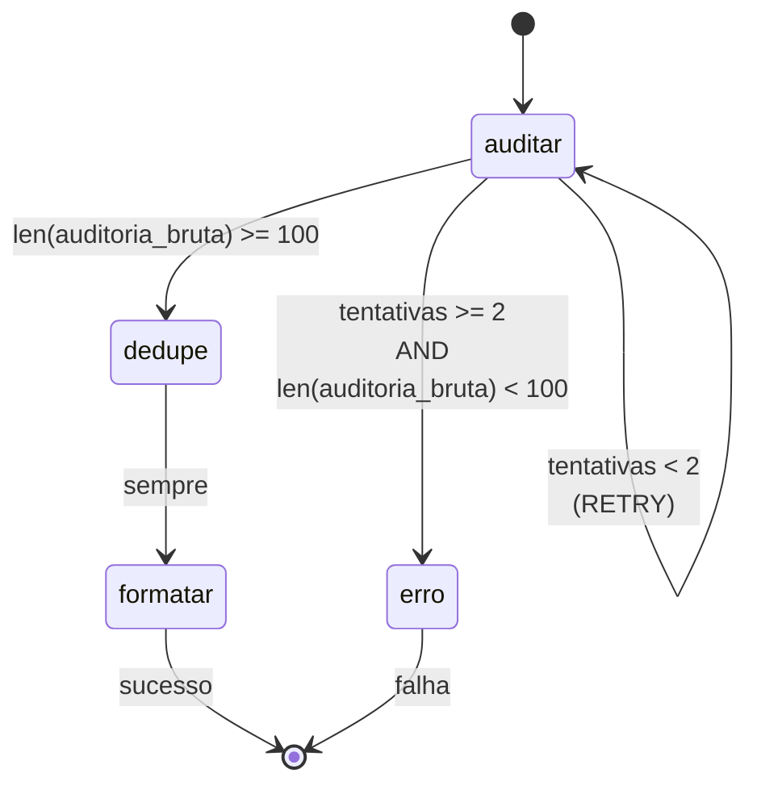
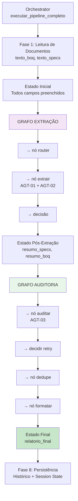
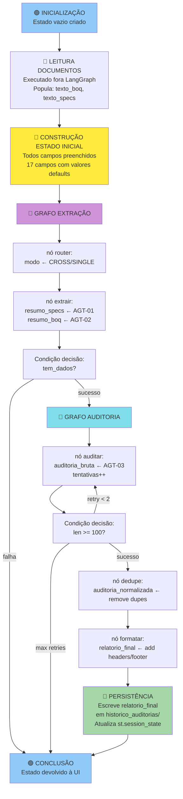

# 6. Gestão de Estados - Análise Detalhada

## 6.1 Conceito Fundamental de Estado

No sistema BlocoAI, **estado é a representação centralizada de todo o contexto de processamento**, encapsulando inputs, dados intermediários, resultados parciais e metadados de execução. Diferentemente de arquiteturas imperativas tradicionais onde dados fluem através de variáveis globais ou passagem de parâmetros, BlocoAI implementa **state machine explícita** baseada no padrão do LangGraph.

### Razão para Estado Centralizado

Em processamento de documentos complexo, múltiplos agentes precisam de compartilhar contexto sem efeitos secundários:

- **AGT-01** (extrator SPECS) precisa apenas de `texto_specs` como entrada
- **AGT-02** (extrator BOQ) precisa de `texto_boq` E de `resumo_specs` (produzido por AGT-01) para contexto de comparação
- **AGT-03** (auditor) precisa de AMBOS os resumos E de `contexto_projeto` para tomar decisões de auditoria

Se cada agente tivesse variáveis locais ou globais, seria impossível:
- Rastrear quem modificou quê
- Fazer retry de um nó mantendo estado consistente
- Debugar interações entre agentes
- Persistir estado parcial para auditoria

Utilizando **state machine unificada**, LangGraph garante que:
1. Cada nó vê snapshot imutável do estado
2. Cada nó produz apenas deltas (mudanças)
3. LangGraph faz merge automático, mantendo histórico lógico
4. Transições entre nós são explícitas e rastreáveis

---

## 6.2 Estrutura Completa do AuditoriaState

O `AuditoriaState` é um `TypedDict` Python que define **contrato exato** entre módulos. Possui 19 campos organizados em 5 categorias:

### 6.2.1 Campos de Entrada (Recolhidos na UI)

```python
texto_boq: str
```
**Conteúdo completo do documento BOQ** após parsing de ficheiro. Contém texto de Bill of Quantities em formato contínuo, com marcadores de rastreabilidade (ex: `[Linha 45]`, `[Pág: 3]`). Pode estar vazio se utilizador não carrega BOQ.

```python
texto_specs: str
```
**Conteúdo concatenado de todos os ficheiros SPECS** carregados. Se múltiplos ficheiros SPECS são carregados, são intercalados com quebras `\n\n` e marcadores de origem (ex: `[Ficheiro: SPECS_Steel.pdf - Pág: 12]`). Pode estar vazio se utilizador não carrega SPECS.

```python
guia_filtragem: str
```
**Instruções ad-hoc do utilizador** para focar análise. Texto livre que AGT-03 utiliza como constraint de auditoria. Exemplo: "Considerar apenas aço estrutural, ignorar sistema de pisos em betão". Campo opcional; pode ser string vazia.

```python
nome_boq: str
```
**Identificador do ficheiro BOQ** (ex: `"projeto_A_boq.csv"`). Utilizado para rastreabilidade em logs e relatório final. String vazia se sem BOQ.

```python
nomes_specs: list[str]
```
**Lista de nomes de ficheiros SPECS** carregados (ex: `["SPECS_Aço.pdf", "SPECS_Proteção.docx"]`). Permite identificar origem de cada secção extraída. Lista vazia se sem SPECS.

### 6.2.2 Campos de Contexto do Projeto

```python
contexto_projeto: dict
```
**Baseline de projeto em formato JSON estruturado**, recolhido na UI. Exemplo:
```json
{
  "project_info": {
    "name": "CSA Tower",
    "type": "New Build - Structural Steel"
  },
  "scope_definition": {
    "phases": ["PH1", "PH2", "PH3"],
    "zones": ["FSA", "DCH", "RoofLevel"],
    "included_trades": {
      "structural_steel": true,
      "steel_decking": true,
      "fire_protection": true
    }
  },
  "critical_notes": "No concrete items in scope"
}
```

AGT-03 utiliza este contexto como "verdade de referência" para auditoria. Se projeto diz `"structural_steel": true` mas BOQ não encontra aço estrutural numa zona esperada, será marcado como CONFLITO/MISSING.

### 6.2.3 Campos de Saída Intermediária (Produzidos por Agentes)

```python
resumo_specs: str
```
**Saída de AGT-01**: Estrutura técnica completa de Especificações em JSON ou narrativo. Exemplo:
```json
{
  "spec_document": {
    "section_code": "05 12 00",
    "title": "Structural Steel Framing"
  },
  "materials": [
    {
      "category": "Structural Steel",
      "grade_or_type": "S355JR",
      "specific_rules": ["Full penetration welds", "Quality Class B per EN 1090-2"]
    }
  ],
  "execution_and_tolerances": [...]
}
```

Campo crítico porque AGT-02 o recebe como contexto de entrada. Se vazio ou inválido, AGT-02 não tem baseline para comparação.

```python
resumo_boq: str
```
**Saída de AGT-02**: Estrutura técnica do BOQ, preservando Phase/Zone mapping. Exemplo:
```
Phase: Phase 1
--> Zone: FSA
    ---> Subzone: Level 1
        * Structural Steel:
            - BOQ: Steel Grade S355JR, bolted connections
            - SPECS: Grade S355JR, full penetration welds
            - STATUS: PARTIAL CONFLICT (bolted vs welded)
```

Campo crítico para AGT-03. Se vazio, auditoria não tem BOQ para comparar contra SPECS.

### 6.2.4 Campos de Saída Final (Produzidos por Nós de Processamento Posterior)

```python
auditoria_bruta: str
```
**Saída bruta de AGT-03** após primeira invocação, antes de normalização. Contém análise cruzada raw de SPECS vs BOQ, com possíveis duplicações, formatação inconsistente, ou extrações parciais. Exemplo:
```
Phase: Phase 1
--> Zone: FSA
    ---> Subzone: L1
        * Structural Steel: ALIGNED
        * Fire Protection: MISSING (SPECS require EI 60 but BOQ silent)
```

Este campo é utilizado como entrada para nó "dedupe" que remove duplicações e normaliza.

```python
auditoria_normalizada: str
```
**Saída de "dedupe"**: Auditoria com duplicações removidas e formatação consistente. Sem alterações semânticas; apenas limpeza de estrutura.

```python
relatorio_final: str
```
**Saída de "formatar"**: Versão final com cabeçalhos, estrutura visual, resumo executivo, e rodapé. Pronta para display na UI e download. Exemplo:
```
═══════════════════════════════════════════════
BlocoAI — RELATÓRIO DE AUDITORIA TÉCNICA CRUZADA
═══════════════════════════════════════════════

PROJETO: CSA Tower
DATA: 2026-05-13 14:23 UTC
FICHEIROS PROCESSADOS: 
  - BOQ: projeto_A_boq.csv
  - SPECS: SPECS_Aço.pdf, SPECS_Proteção.docx

───────────────────────────────────────────────
SUMÁRIO EXECUTIVO
───────────────────────────────────────────────
...
```

---

### 6.2.5 Campos de Controlo de Fluxo

```python
modo: str
```
**Modo de operação**: `"CROSS"` (se ambos BOQ e SPECS presentes) ou `"SINGLE"` (se apenas um). Determinado pelo nó "router" na fase inicial. Controla qual pipeline é executado e como AGT-03 comporta-se (auditoria cruzada vs validação de documento único).

```python
tentativas: int
```
**Contador de retry do nó AGT-03**. Inicializa a 0. Cada vez que AGT-03 retorna output com menos de 100 caracteres (falha de qualidade), contador incrementa e LangGraph re-executa nó. Quando atinge limite (2), pipeline abandona retry e vai para "erro".

```python
erros: list[str]
```
**Lista acumulativa de mensagens de erro**. Cada nó que falha adiciona mensagem descritiva (ex: `"AGT-01 falhou: APITimeoutError after 4 retries"`). Se `erros` não vazio ao fim do pipeline, UI exibe relatório de erros junto com output parcial.

### 6.2.6 Campos de Metadados

```python
n_ficheiros: int
```
**Contagem total de ficheiros processados**: (1 se BOQ + N se M ficheiros SPECS). Utilizado para display informativo e validação (ex: "0 ficheiros" é erro).

```python
paginas_sem_texto: list[str]
```
**Lista de identificadores de páginas sem OCR extraível** (em PDFs digitalizados). Exemplo: `["SPECS_Aço.pdf pág. 5", "SPECS_Aço.pdf pág. 12"]`. Utilizado para avisar utilizador que certas secções não foram processadas. Crítico para rastreabilidade.

### 6.2.7 Campos Internos (Passagem de Referências)

```python
_api_key: str
```
**Chave de API em formato string**. Armazenada em estado para que nós LangGraph a acessem sem invocar Streamlit session state (que é isolado ao thread da UI). Nunca é persistido em ficheiro; apenas em memória de runtime.

```python
_prog_slot: Any
_status_slot: Any
```
**Referências a Streamlit placeholders** para barra de progresso e status. Nós invocam estes para actualizar UI em tempo real (ex: `status_slot.markdown("AGT-02 processando...")`). Permitida apenas dentro de contexto Streamlit; nó "dedupe" que executa fora UI não tem acesso.

---

## 6.3 Evolução do Estado através das Fases

### Diagrama: Estados em Cada Fase



---

## 6.4 Ciclo de Vida Detalhado de um Campo de Estado

Vamos rastrear **campo `resumo_specs`** através de todo o pipeline:

### Inicialização
```python
# orchestrator.py, linha ~80
estado = {
    "resumo_specs": "",  # Campo inicializado vazio
    ...
}
```
**Estado**: `resumo_specs = ""` (string vazia)

### Preenchimento por AGT-01
```python
# langgraph_engine.py, função no_extrator()
def no_extrator(state: AuditoriaState) -> dict:
    if state.get("texto_specs"):
        resumo_specs = extrair_specs(
            texto_specs=state["texto_specs"],
            nome_ficheiro="SPECS: ...",
            llm=llm_specs,
            ...
        )
    
    return {
        "resumo_specs": resumo_specs,  # Delta retornado
        "resumo_boq": resumo_boq,
        ...
    }

# LangGraph faz merge:
# estado.update({"resumo_specs": "{ \"spec_document\": { ... } }"})
```
**Estado após AGT-01**: `resumo_specs = "{ \"spec_document\": { ... }, \"materials\": [...], ...}"` (JSON válido)

### Utilização por AGT-02
```python
# langgraph_engine.py, função extrair_boq_com_contexto()
def extrair_boq_com_contexto(
    texto_boq: str,
    nome_ficheiro: str,
    contexto_specs: str,  # <-- Recebe resumo_specs aqui
    contexto_projeto: dict,
    ...
):
    # AGT-02 utiliza resumo_specs para contextualizar extração de BOQ
    sys_msg = SystemMessage(content=f"""
    ...
    SPECS CONTEXT (for awareness):
    {contexto_specs}  # <-- Injetado no prompt
    ...
    """)
```
**Uso**: `resumo_specs` é injetado como contexto no prompt de AGT-02, informando extrator de BOQ que "Specs requerem S355JR, Full Penetration Welds, etc."

### Passagem para AGT-03
```python
# orchestrator.py, fase 2 do pipeline
for output in grafo_auditoria.stream(estado, ...):
    estado.update(output[node_name])

# Estado contém resumo_specs que já foi computado
# AGT-03 o recebe intacto
```

### Utilização por AGT-03
```python
# langgraph_engine.py, função no_auditor()
def no_auditor(state: AuditoriaState) -> dict:
    dados = (
        f"=== BOQ EXTRACTS ===\n{state.get('resumo_boq','')}\n\n"
        f"=== SPECS BASELINE BULLETS ===\n{state.get('resumo_specs','')}"  # <-- Utilizado
    )
    
    # Ambos resumos são concatenados para prompt de comparação
```
**Uso Final**: `resumo_specs` é concatenado com `resumo_boq` e injetado no prompt de AGT-03 para análise cruzada.

### Propagação ao Relatório Final
```python
# langgraph_engine.py, função no_apresentador()
# (implicitamente; relatório contém análise que veio de resumo_specs)
# Não modificado; apenas referenciado indiretamente
```

### Diagrama: Rastreamento de Campo `resumo_specs`



---

## 6.5 Garantia de Consistência: Imutabilidade de Estado

BlocoAI implementa **padrão imutável** onde cada nó não modifica estado diretamente:

### Padrão Imperativo (❌ Evitar)
```python
# Pseudo-código de como NÃO fazer
def nó_extrator_ruim(estado_global):
    estado_global["resumo_specs"] = extrair_specs(...)  # MODIFICAÇÃO DIRETA
    estado_global["resumo_boq"] = extrair_boq(...)       # MODIFICAÇÃO DIRETA
    # Problema: Estado global pode ser corrompido por múltiplos nós
```

### Padrão Imutável (✅ Implementado)
```python
# Código real de BlocoAI
def no_extrator(state: AuditoriaState) -> dict:
    # 'state' é snapshot (leitura apenas, em prática)
    resumo_specs = extrair_specs(state["texto_specs"], ...)
    resumo_boq = extrair_boq_com_contexto(state["texto_boq"], ...)
    
    # Retorna DELTA (diferenças apenas)
    return {
        "resumo_specs": resumo_specs,
        "resumo_boq": resumo_boq,
        # NOTA: Não retorna texto_boq, texto_specs, etc.
        # LangGraph preserva campos não retornados
    }

# LangGraph faz merge:
# novo_estado = {...estado_anterior, ...delta_retornado}
```

**Vantagens:**
1. **Rastreabilidade**: Cada alteração é explícita em return value
2. **Determinismo**: Dado mesmo input, sempre mesmo output (sem side effects)
3. **Rollback Teórico**: Possível recompor estado anterior se retry necessário
4. **Debugging**: Fácil inspecionar "qual nó modificou qual campo"

---

## 6.6 Transições de Estado no Grafo

### Diagrama: Máquina de Estados do Grafo Extração



### Diagrama: Máquina de Estados do Grafo Auditoria



---

## 6.7 Orquestração de Múltiplos Grafos

BlocoAI invoca **dois grafos sequencialmente**, passando estado entre ambos:

### Diagrama: Fluxo de Dois Grafos



---

## 6.8 Transformações Semânticas de Estado

Cada nó transforma estado de forma **bem definida e rastreável**:

| Nó | Input | Output | Transformação |
|---|---|---|---|
| **router** | `texto_boq`, `texto_specs` | `modo` | Determinação de modo CROSS/SINGLE baseada em presença de inputs |
| **extrair** | `texto_specs`, `texto_boq` | `resumo_specs`, `resumo_boq` | Extração semântica de texto bruto para JSON/narrativo estruturado |
| **auditar** | `resumo_specs`, `resumo_boq`, `contexto_projeto` | `auditoria_bruta`, `tentativas` | Análise cruzada de dois contextos, output narrativo, retry logic |
| **dedupe** | `auditoria_bruta` | `auditoria_normalizada` | Remoção de linhas duplicadas, formatação consistente |
| **formatar** | `auditoria_normalizada` | `relatorio_final` | Adição de cabeçalhos, resumo executivo, rodapé |

---

## 6.9 Diagrama Completo: Ciclo de Vida do Estado



---

## 6.10 Resumo: Princípios de Gestão de Estado

| Princípio | Implementação | Benefício |
|-----------|----------------|-----------|
| **Centralização** | Um único `AuditoriaState` TypedDict | Visibilidade total; sem variáveis espalhadas |
| **Tipagem Explícita** | TypedDict com 19 campos nomeados | IDE suporta; linter detecta erros de acesso |
| **Imutabilidade** | Nós retornam deltas; LangGraph faz merge | Determinismo; rastreabilidade de alterações |
| **Sequenciamento Explícito** | Grafos com nós e arestas dirigidas | Fluxo claro; impossível executar fora de ordem |
| **Retry Automático** | Contador `tentativas` + conditional edge | Tolerância a falhas transientes sem duplicação de código |
| **Rastreabilidade** | Campo `erros[]` acumula mensagens | Auditoria pós-execução; debugging facilitado |
| **Metadados Preservados** | Campos como `paginas_sem_texto`, `n_ficheiros` | Contexto completo para interpretação de resultados |

A gestão de estado em BlocoAI é assim um **pilar arquitetónico**, não apenas um detalhe de implementação. Permite que o sistema seja simultaneamente **explícito** (fácil de entender fluxo), **robusto** (retry automático), e **auditável** (histórico completo de transformações).
